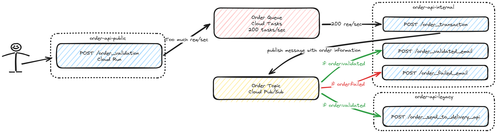
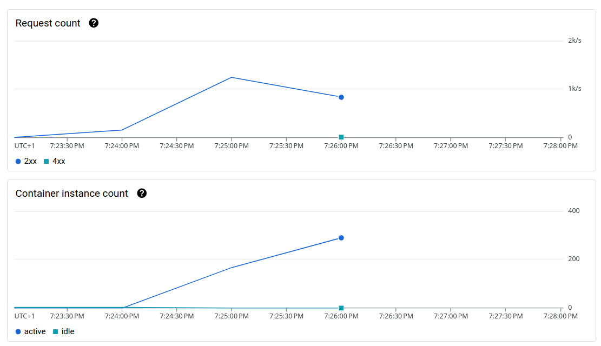
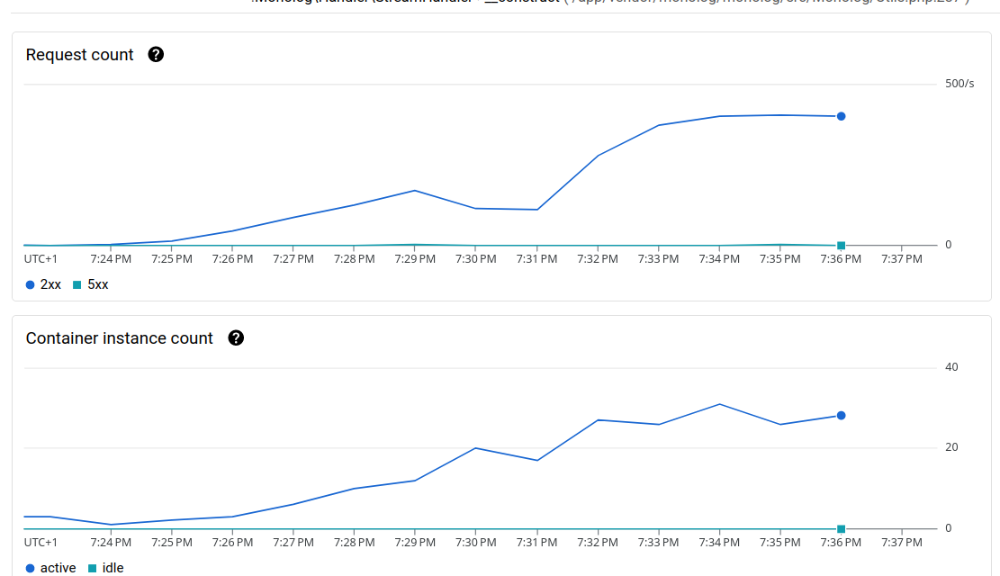
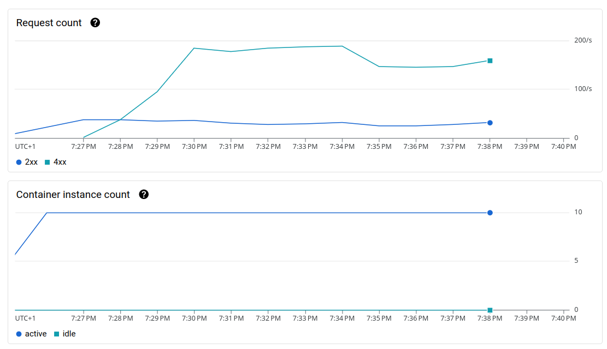
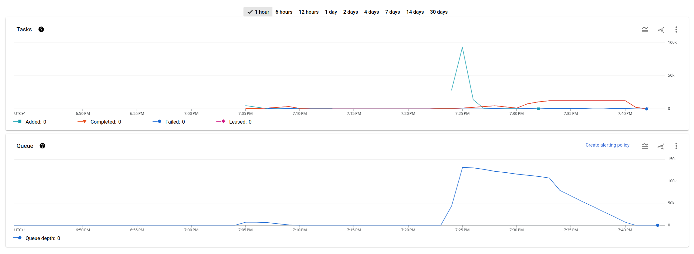
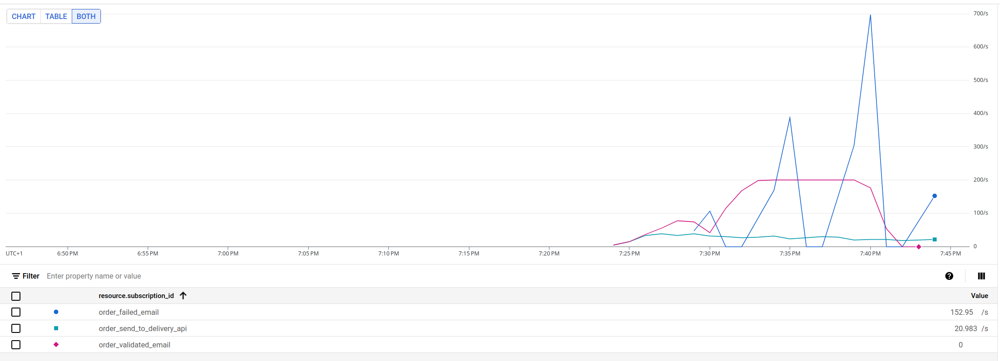

# GCP use case : Async message avec Cloud Tasks et Cloud Pub/Sub

Développement d'une petite partie d'un système de commande pour un site e-commerce utilisant les avantages de Cloud
Tasks et Cloud Pub/Sub pour un grand nombre de commandes.



L'utilisateur va devoir faire un appel à notre api de commande (order-api)
sur un endpoint public `/order_validation`. Ce endpoint doit être le plus rapide possible. On valide la commande
auprès du système de payement (validation du code commande) avant de pousser un message dans la queue (Order Tasks) pour
traiter le reste de manière asynchrone.

Le reste du processus est asynchrone et comprend la revalidation de la commande, la persistance en BDD, l'envoi de la
commande à l'API de livraison et l'e-mail de validation/échec de la commande.

## Cloud Tasks

Cloud Tasks est un service de tâche ou **l'appelant créer la tâche avec l'action** à effectuer.
Dans notre cas, on va demander à Cloud Tasks d'envoyer une requête à notre api interne sur l'
endpoint `/order_transaction`.
Les tâches sont traité en **FIFO** (First In first Out).

**Attention** dans la documentation, il est précisé que le handler
doit être idempotent : il faut gérer la potentielle duplication de message à la reception.

> Cloud Tasks is designed to provide "at least once" delivery; that is, if a task is successfully added, the queue will
> deliver it at least once. In some rare circumstances, multiple task execution is possible, so your code must ensure
> that
> there are no harmful side-effects of repeated execution. Your handlers should be
> idempotent. [Documentation Cloud Tasks](https://cloud.google.com/tasks/docs/dual-overview?hl=en)

Voici le code en PHP nous permettant de pousser un message dans la queue :

```php
// in App\Controller\OrderValidationController.php

private function sendOrderTransactionTask(Order $order): void
{
    /**
     * On va créer une tache de type HttpRequest qui va correspondre à la requête à exécuter de manière asynchrone.
     */
    $taskRequest = new HttpRequest();
    $taskRequest->setHttpMethod(HttpMethod::POST);
    $taskRequest->setHeaders([
        'Content-Type' => 'application/json'
    ]);
    $taskRequest->setBody($this->serializer->serialize($order, 'json'));
    $taskRequest->setUrl(sprintf("%s%s", $this->internalHost, $this->router->generate('order_transaction')));

    $task = new Task();
    $task->setHttpRequest($taskRequest);

    $client = new CloudTasksClient();
    $client->createTask($this->orderQueue, $task);
}
```

Une contrainte de cette implémentation, c'est que notre appelant doit connaitre l'URL de destination de notre tâche.

## Cloud Pub/Sub

Cloud Tasks va envoyer les tâches sur notre endpoint `/order_transaction`. Après validation et persistance de la
commande, il va pousser un message dans notre Pub/Sub.

Le message est ajouté à un topic et des subscribers vont venir écouter notre topic.

> Le terme Pub/Sub n'est pas propre au service que propose
> Google : https://en.wikipedia.org/wiki/Publish%E2%80%93subscribe_pattern

Voici le code permettant de pousser un message :

```php
// in App\Controller\OrderTransactionController.php

public function sendOrderTransactionMessage(Order $order): void
{
    $pubSub = new PubSubClient();

    // On pousse sur le topic "order-events" notre message
    $topic = $pubSub->topic('order-events');
    $topic->publish([
        'data' => $this->serializer->serialize($order, 'json'),
        'attributes' => [
            'message' => 'order_transaction:succeed'
        ],
    ]);
}
```

Notre topic `order-events` correspond à un topic assez générique qui peut recevoir plus type de message.
Pour discriminer les messages, on peut utiliser les `attributes` qui vont permettre a nos subscribers de filtrer les
messages à lire. Par exemple, en ne prenant en compte que les messages `order_transaction:succeed`.

> L'avantage d'utiliser les filtres au lieu de multiplier les topics et de réduire le code infrastructure (Terraform) et
> de permettre a nos subscriber de traiter plusieurs types de message puisque la relation entre topic et subscriber est
> de 1-N : 1 topic pour plusieurs subscribers mais pas l'inverse.

Pub/Sub ne propose pas de système de rate limit et transmet autant de message qu'il en reçoit. Dans notre cas notre API
reçoit 200 req/sec, mais avec le Pub/Sub et les subscriptions qui font aussi appel a notre API, on monte à 400 req/sec.

De la même manière notre api "legacy", qui prend en compte le lien avec la _Delivery API_, ne peut traiter que
50 req/sec pourtant Pub/Sub lui en transmet 200.

## Résultats des tests de charges

Le stress test dur 2 minutes et va monter jusqu'à 400 requêtes en parallèles sur notre endpoint `/order_validation`. Le système
est "froid" avec aucun conteneur Cloud Run de démarré

Résultat du test : 

```
 checks.........................: 99.96% ✓ 132884      ✗ 44    
 data_received..................: 20 MB  165 kB/s
 data_sent......................: 19 MB  159 kB/s
 http_req_blocked...............: avg=146.61µs min=110ns    med=315ns    max=249.02ms p(90)=839ns    p(95)=943ns   
 http_req_connecting............: avg=60.46µs  min=0s       med=0s       max=163.66ms p(90)=0s       p(95)=0s      
 http_req_duration..............: avg=230.04ms min=14.82ms  med=156.02ms max=10.49s   p(90)=349.94ms p(95)=457.13ms
   { expected_response:true }...: avg=228.03ms min=114.28ms med=156.02ms max=5.25s    p(90)=349.59ms p(95)=456.6ms 
 http_req_failed................: 0.03%  ✓ 44          ✗ 132884
 http_req_receiving.............: avg=195.09µs min=0s       med=34.27µs  max=127.14ms p(90)=138.24µs p(95)=1.05ms  
 http_req_sending...............: avg=52.53µs  min=15.57µs  med=36µs     max=10.13ms  p(90)=95.54µs  p(95)=105.04µs
 http_req_tls_handshaking.......: avg=85.13µs  min=0s       med=0s       max=147.9ms  p(90)=0s       p(95)=0s      
 http_req_waiting...............: avg=229.8ms  min=14.79ms  med=155.79ms max=10.49s   p(90)=349.58ms p(95)=456.94ms
 http_reqs......................: 132928 1106.689421/s
 iteration_duration.............: avg=230.32ms min=14.9ms   med=156.34ms max=10.49s   p(90)=350.25ms p(95)=457.53ms
 iterations.....................: 132928 1106.689421/s
 vus............................: 1      min=1         max=400 
 vus_max........................: 400    min=400       max=400 

```

> J'ai eu quelques problèmes de connexion, mais ça représente un faible volume d'erreur.

Au total, on a traité 1100 req/sec et un temps median a 156.02ms.



Côté Cloud Run, on retrouve la stat de 1100 req/sec et un maximum de 289 conteneurs. 😵

Et dans notre Cloud Run internal, on retombe sur nos 400 req/sec


Sur notre Cloud Run "Legacy", on observe que lorsque notre environnement ne suit pas, on tombe sur des erreurs 429 (Too Many Requests)



> Le Cloud Run est configuré avec un maximum de 10 conteneurs.

Sur Cloud Tasks, on peut suivre nos tâches :



> Il aura fallu plus de 15 minutes pour traiter l'ensemble des messages reçus sur les 2 minutes.


Et pour finir dans Cloud Pub/Sub, on peut voir le détail par subscription :



